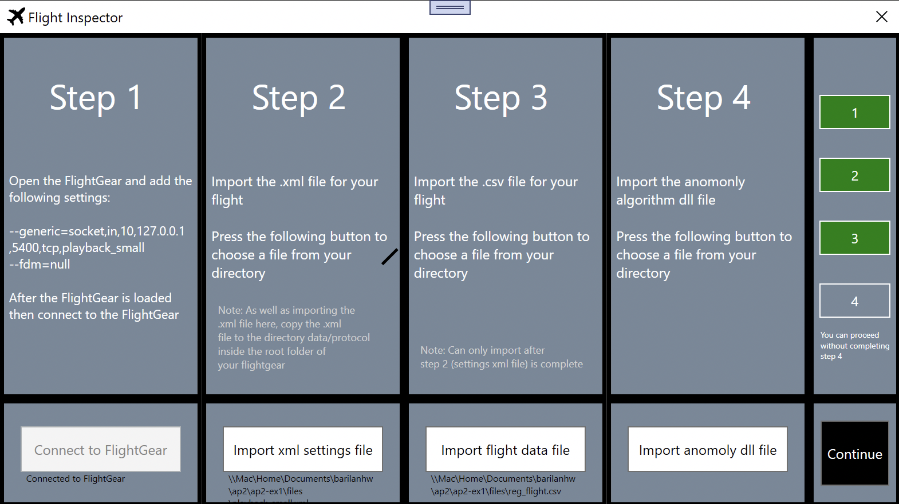
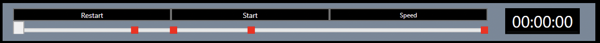

# Flight Inspector Desktop Application
About the application
---------------------
This is a flight inspector desktop application. The application works as following:  
  
In the **Opening screen**, the user insetrs the .csv file with the flight data and the .xml file with the flight data settings, connects to the FlightGear application, which should be opened by the user, and inserts an algorithm to detect anomaly (optional). Then, the application moves to the **Main screen**.    
 
The **Main screen** contains the following:  
**Scrollbar** that indicates the current time of the flight video, which is controlled by the user. The user can move the scrollbar to the exact time point that he wants to make 
the application show the data of that time point. From the scrollbar, the user can pause, play and increase the speed of the flight video.  
  
**Statistics window** that shows some important data like altimeter, airspeed and more.  
**Graphs window** that shows 3 graphs about the data property that the user has chosen:
Graph of that data property, graph of the data property with is most corelative to the current data property, and graph that shows the linear regression between those two data properties.  
//photo  
**Rudder window** that contains the joystick and the rudder and throttle measures.  
//photo  

**The FlightGear application shows the flight video, while the flight inspector application shows and analyzes the data.**  
  
About the project structure
---------------------------
The project contains 3 directories:  
***Model directory*** which contains the class that are related to the model. *FlightGearModel* is the facade model class, which implements the *IFlightGearModel* interface.  
This class contains an instance of an object that implements the *IAsyncFGClient* interface, and uses that object to communicate with the FlightGear asynchronously.  
In this way, the *IFlightGearModel* and *IAsyncFGClient* interfaces are built together in the *Strategy design pattern*, which allows you to combine a *FlightGearModel* with every *AsyncFGClient* which implements the *IAsyncFGClient* interface. In the project, we implemented the *AsyncTcpFGClient*, which helps the *FlightGearModel* to communicate with the *FlightGear* in TCP protocol.  
***ViewModel directory*** which contains a ViewModel for every user control, for example - the *PlayBackViewModel* is a ViewModel for the playback scrollbar, which gets from the 
model the data which is relevant to the scrollbar (like the flight video speed), and decorates the relevant operations of the model for the scrollbar, like *Render* which starts 
the rendering of the flight data. There is a data binding between every ViewModel to its user control.  
***View directory*** which contains the .xaml file and the C# code behind for every user controls and window. The directory contains 2 windows - *Opening window*, and *Main window*, and all of the user controls which exist in those windows.  

Required installations
----------------------
The application is written in **WPF .NETCORE 3.0**.  
To run the application you should have the following:  
**.NETCORE 3.0 environment**. The *.NETCORE* version should be at least 3.0, because this is the first version which supports *WPF*.  
**OxyPlot plugin for WPF**. *OxyPlot* plugin is used to produce and show the graphs of the flight data.  
**FlightGear application**. The *FlightGear* application is used to show a video of the flight. We recommand to use the last version of the *FlightGear*, which can be downloaded in the link **www.flightgear.org**.  

Installation and Running instructions
-------------------------------------
There are **many ways** to run the application. The easiest is to run it from **Visual Studio**, but it is important to know that there are **other options**, like compiling  
the code manualy and run in a *.NETCORE 3.0* environment. Notice that the *OxyPlot* plugin is requird to run the applicaiton.  
  
*How to run the application in Visual Studio ?*  
**First**, install the Visual Studio and **clone this repository**.  
**Second**, install the *OxyPlot* plugin. In Visual Studio: **Project -> Manage NuGet Packages -> Browse -> Search "OxyPlot Wpf" -> Install OxyPlot.Wpf**  
**Then**, run the application by pressing the green run button in the Visual Studio. The *Opening window* will be opened, and the instructions will be showed there. Then open the *FlightGear* application and do the instructions which are showed in our application.  

